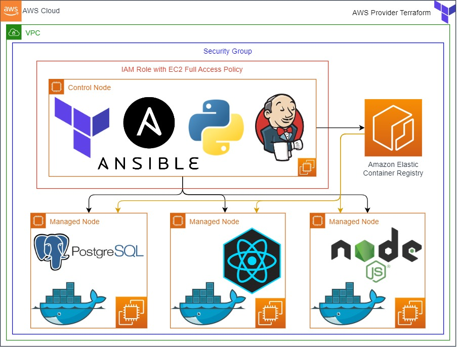

<h1 align="center">Web Page Application deployment on AWS with Jenkins, Ansible, Docker and ECR</h1>

<p align="center">
  
  
  
  
  
  
  
  
  
  
  <!--  -->
  <!--  -->
  <!--  -->
</p>

<p align="center">
  <a href="#dart-about">About</a> &#xa0; | &#xa0; 
  <a href="#sparkles-Contents">Contents</a> &#xa0; | &#xa0;
  <a href="#rocket-technologies">Technologies</a> &#xa0; | &#xa0;
  <a href="#white_check_mark-requirements">Requirements</a> &#xa0; | &#xa0;
  <a href="#checkered_flag-starting">Starting</a> &#xa0; | &#xa0;
  <a href="#memo-license">License</a> &#xa0; | &#xa0;
  <a href="https://github.com/devenes" target="_blank">Author</a>
</p>

## 📜 Project Architecture



## :dart: About

This project aims to create a Jenkins pipeline to deploy web-page written Nodejs and React Frameworks on AWS Cloud Infrastructure using Ansible. Building infrastructure process is managing with control node utilizing Ansible. This infrastructure has 1 jenkins server (`Amazon Linux 2 AMI`) as ansible control node and 3 EC2's as worker node (`Red Hat Enterprise Linux 8 with High Availability`). These EC2's will be launched on AWS console. Web-page has 3 main components which are postgresql, nodejs, and react. Each component is serving in Docker container on EC2s dedicated for them. Postgresql is serving as Database of web-page. Nodejs controls backend part of web-side and react controls frontend side of web-page. The code was written by Devenes and architecture will be created by AWS & DevOps Team.

## :sparkles: Contents

- [📜 Project Architecture](#-project-architecture)
- [:dart: About](#dart-about)
- [:sparkles: Contents](#sparkles-contents)
- [:rocket: Technologies](#rocket-technologies)
- [📝 Case Study Description](#-case-study-description)
- [:white_check_mark: Requirements](#white_check_mark-requirements)
- [:checkered_flag: Starting](#checkered_flag-starting)
- [📌 Expected Outcome](#-expected-outcome)
  - [At the end of the project, following topics are to be covered](#at-the-end-of-the-project-following-topics-are-to-be-covered)
  - [At the end of the project, developers will be able to](#at-the-end-of-the-project-developers-will-be-able-to)
- [📦 Resources](#-resources)
- [:memo: License](#memo-license)

## :rocket: Technologies

The following tools were used in this project:

- [Docker](https://www.docker.com/)
- [Javascript](https://developer.mozilla.org/en-US/docs/web)
- [React.js](https://reactjs.org/)
- [Node.js](https://nodejs.org/)
- [Ansible](https://www.ansible.com/)
- [AWS](https://aws.amazon.com/)
- [PostgreSQL](https://www.postgresql.org/)
- [Git](https://git-scm.com/)
- [Github](https://github.com/)
- [Terraform](https://www.terraform.io/)
- [Jenkins](https://jenkins.io/)

## 📝 Case Study Description


- Your team has recently ended up a project that aims to serve as web page. You and your colleagues are assigned to work on this project. Devenes has done with code and DevOps team is going to deploy the app in production environment using ansible.

- Application is coded by Devenes and given you as DevOps team. Web-page allows users to collect their infos. Registration data should be kept in separate PostgreSQL database located in one of EC2s. Nodejs framework controls backend and serves on port 5000, it is als connected to the PostgreSQL database on port 5432. React framework controls the frontend and it is also connected to the Nodejs server on port 5000. React server broadcasts web-page on port 3000.

- The Web Application will be deployed using Nodejs and React framework.

- The Web Application should be accessible via web browser from anywhere on port 3000.

- EC2's and their security groups should be created on AWS console with Terraform.

- The rest of the process has to be controlled with control node which is connected SSH port.

- Postgresql, Nodejs and React parts has to be placed in docker container.

- Your project manager wants the DevOps team to launch an EC2 for each postgresql, nodejs and react docker container. In addition, he asks to write one playbook for this project to install and configure docker and create containers in each instances.

- You are also requested; to use AWS ECR as image repository, to create Docker Containers with 3 managed nodes (postgresql, nodejs and react EC2 instances).

In the architecture, you can configure your architecture with these conditions,

- Create a new `private` repository for the project on GitHub.

- All process has to be controlled into the `jenkins server` as control node.

- Dynamic inventory (`inventory_aws_ec2.yml`) has to be used for inventory file.

- Ansible config file (`ansible.cfg`) has to be placed in jenkins server.

- Docker should be installed in all worker nodes using ansible.

- Docker images should be build in jenkins server and pushed to the AWS ECR.

- `team_files` file should be pulled from Github Repo at the beginning. Then these files should be copy to related folders.

- For PostgreSQL worker node

  - Docker image should be created for PostgreSQL container with `Dockerfile.postgresql` and `init.sql` file should be placed under necessary folder.

  - Docker images should be build in jenkins server from `Dockerfile.postgresql` and pushed to the AWS ECR.

  - Create PostgreSQL container in the worker node. Do not forget to set password as environmental variable.

  - Please make sure this instance's security group should be accept traffic from PostgreSQL's dedicated port from Nodejs EC2 and port 22 from anywhere.

  - To keep database's data, volume has to be created with docker container and necessary file(s) should be kept under this file.

  - For Nodejs worker node

    - Please make sure to correct or create `.env` file under `server` folder based on PostgreSQL environmental variables. To automize taking private ip of postgresql instance you can use linux `envsubst` command with env-template.

    - Docker image should be created for nodejs container with Dockerfile.nodejs and `server` files should be placed under necessary folder. This file will use for docker image. You don't need any extra file for creating Nodejs image.

    - Docker image should be built for Nodejs container in jenkins server from `Dockerfile.nodejs` and pushed to the AWS ECR.

    - Create Nodejs container in nodejs instance with ansible and publish it on port 5000.

    - Please make sure this instance's security group should be accept traffic from 5000, 22 dedicated port from anywhere.

  - For React worker node

    - Please make sure to correct `.env` file under `client` folder based on Nodejs environmental variables. To automize taking public ip of nodejs instance, you can use linux `envsubst` command with env-template.

    - Docker image should be created for react container with Dockerfile.react and `client` files should be placed under necessary folder. This file will be used for docker image. You don't need any extra file for creating react image.

    - Docker image should be built for React container in jenkins server from `Dockerfile.react` and pushed to the AWS ECR.

    - Create React container and publish it on port 3000.

    - Please make sure this instance's security group should be accept traffic from 3000, and 80 dedicated port from anywhere.

  - To use the AWS ECR as image repository;

    - Enable the instances with IAM Role allowing them to work with ECR repos using the instance profile.

    - Install AWS CLI `Version 2` on worker node instances to use `aws ecr` commands.

- To create a Jenkins Pipeline, you need to launch a Jenkins Server with security group allowing SSH (port 22) and HTTP (ports 80, 8080) connections. For this purpose, you can use pre-configured [_Terraform configuration file for Jenkins Server enabled with Git, Docker, Terraform, Ansible and also configured to work with AWS ECR using IAM role_](./jenkins_server/main.tf).

- Create a Jenkins Pipeline with following configuration;

  - Build the infrastructure for the app on EC2 instances using Terraform configuration file.

  - Create an image repository on ECR for the app.

  - Build the application Docker image and push it to the same ECR repository with different tags.

  - Deploy the application on AWS EC2's with ansible.

  - Make a failure stage and ensure to destroy infrastructure, ECR repo and docker images when the pipeline failed.

## :white_check_mark: Requirements

Before starting :checkered_flag:, you need to have [Git](https://git-scm.com), [Terraform](https://www.terraform.io/) and [Jenkins](https://jenkins.io/) installed.

## :checkered_flag: Starting

```bash
# Clone the project
git clone https://github.com/devenes/jenkins-ansible-ecr-app

# Access the project folder
cd jenkins-ansible-ecr-app/jenkins_server

# Initialize terraform
terraform init

# Run the project with terraform
terraform apply -auto-approve

# After you see the Jenkins server is running, you can access it by following the link below
<http://JENKINS_SERVER_IP>:8080

# Connect to the Ansible server with SSH and get the project files
git clone https://github.com/devenes/jenkins-ansible-ecr-app

# After you configured the Jenkins server and the project files, you can start the project by using Ansible playbook
ansible-playbook -i inventory_aws_ec2.yml -u ec2-user playbook.yml

# The server will initialize in the <http://<REACT_SERVER>:3000>
```

## 📌 Expected Outcome


### At the end of the project, following topics are to be covered

- Jenkins Pipeline Configuration

- Create infrastructure with Terraform

- Deploy the application with Ansible

- Ansible playbook preparation

- Docker image creation for postgresql, nodejs and react containers

- Docker container launching using created image with ansible playbook

- Bash scripting

- AWS ECR as Image Repository

- AWS IAM Policy and Role Configuration

- AWS EC2 Launch Template Configuration

- AWS EC2 Configuration

- AWS EC2 Security Group Configuration

- Git & Github for Version Control System

### At the end of the project, developers will be able to

- demonstrate how to configure Jenkins pipeline to create infrstructure with terraform.

- demonstrate how to configure Jenkins pipeline to deploy app with ansible.

- demonstrate how to configure Dockerfile.

- set up 3 containers to work with AWS ECR for pulling docker images.

- deploy an application with ansible.

- create and configure AWS ECR from the AWS CLI.

- use Docker commands effectively to tag, push, and pull images to/from ECR.

- demonstrate bash scripting skills using `user data` section in terraform to install and setup environment for ansible manged nodes.

- demonstrate their configuration skills of AWS EC2, IAM Policy, Role, Instance Profile, and Security Group.

- apply git commands (push, pull, commit, add etc.) and Github as Version Control System.

## 📦 Resources

- [Ansible Documentation Framework](https://docs.ansible.com/ansible/2.5/user_guide/index.html)
- [AWS CLI Command Reference](https://docs.aws.amazon.com/cli/latest/index.html)
- [Authenticating Amazon ECR Repositories for Docker CLI with Credential Helper](https://aws.amazon.com/blogs/compute/authenticating-amazon-ecr-repositories-for-docker-cli-with-credential-helper/)
- [Docker Reference Page](https://docs.docker.com/reference/)
- [Jenkins Handbook](https://www.jenkins.io/doc/book/)

## :memo: License

This project is under license from MIT. For more details, see the [LICENSE](LICENSE) file.

Made with :heart: by <a href="https://github.com/devenes" target="_blank">devenes</a>

&#xa0;

<a href="#top">⬆️ Back to top</a>
